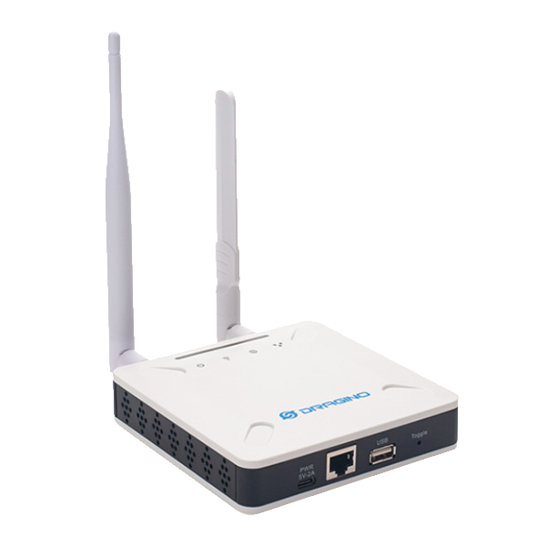
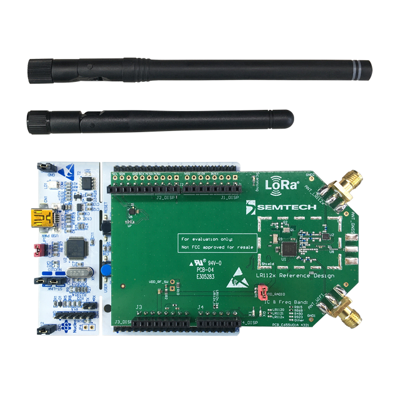

# Projet R&D LR-FHSS

## Sommaire

- [Base de Travail](#base-de-travail)
  - [Sources](#sources)
  - [Équipements](#équipements)
  - [Services](#services)

## Base de travail

### Sources 

Projet Github [SWL2001](https://github.com/Lora-net/SWL2001)

[Voir la documentation d'ogine](./Original-README.md)

### Équipements  

 

| <h3>**Passerelle LoRa Dragino LPS8-v2** | <h3>**2 x Kit de développement  Semtech LR1121DVK1TBKS** |
|:-:|:-:|
|  |  |

### Serivces

**Site web de gestion du réseau LoRa sous Chirpstack 4.0 (Plateform LoRaWan)***</h4>**

 [voir le site](https://chirpstack.vps.gus.giize.com) | identifiant : ***visiteur@localhost*** mot de passe : ***visiteur***

